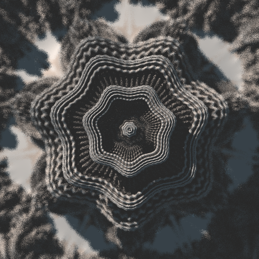

# RUG Computer Graphics Competition Submission

## Ray Marching Fractals

This is our submission for the competition of the Computer Graphics course at the University of Groningen. We have extended the given ray tracing framework by adding ray marching and we use this to render 3D fractals. Ray marching is a technique similar to ray tracing where rays are marched forward step by step. Once a ray is close enough to an object we count it as an intersection.

To determine how far a ray should go at every step we query each object's _distance estimator_. A distance estimator is a function that gives a lower bound for the distance to an object at a given point. If we take the minimum of the distance estimators for every object in the scene at the current position of the ray, we are guaranteed to be able to march along the ray's direction at least that far without intersecting any object.

Many simple objects such as spheres and cubes have well defined distance estimators, but more importantly for our purposes, numerous interesting fractals also have known distance estimators. The most well known of these fractals is the [Mandelbulb](https://en.wikipedia.org/wiki/Mandelbulb). For more information on distance estimated fractals and ray marching in general we recommend Mikael Hvidtfeldt Christensen's [blog posts](http://blog.hvidtfeldts.net/index.php/2011/06/distance-estimated-3d-fractals-part-i/) and Inogo Quilez's [articles](https://www.iquilezles.org/www/index.htm). These resources proved invaluable to us.

## Compiling the Code

We based our code on the ray tracing framework from the Computer Graphics taught at the University of Groningen. The build process remains unchanged.

We provided a [CMakeLists.txt](CMakeLists.txt) file to be used with `CMake`. This can be used in the following way (on the command line/shell):

```
# cd into the main directory of the framework
mkdir build   # create a new build directory
cd build      # cd into the directory
cmake ..      # creates a Makefile
# Compiling the code can then be done with:
make
# or
make -j4      # replacing 4 with the number of cores of your computer
```

**Note!** After adding new `.cpp` files, `cmake ..` needs to be called

## Running the Ray Marcher

After compilation you should have the `competition` executable. This can be used like this:

```
./competition <path to .json file> [output .png file]
# when in the build directory:
./competition ../scenes/ray_marched_sphere/ray_marched_sphere.json
```

Specifying an output is optional and by default an image will be created in the same directory as the source scene file with the `.json` extension replaced by `.png`.

## Scene Files

Scene files are structured in JSON and can be found in the `scenes` folder. If you have never worked with JSON, please see [here](https://en.wikipedia.org/wiki/JSON#Data_types_and_syntax) or [here](https://www.json.org). Take a look at the existing scenes for the general structure before trying to make your own scenes.

The scene files of interest are those in the `menger_sponge` and `mandelbulb` folders. There are three versions of each scene file:

* A `scene_fast.json` version that renders quickly (around 10 seconds on modern hardware), but is only 512 x 512 pixels and performs no super sampling.

* A `scene_low_res.json` version that renders moderately fast (around 1 minute on modern hardware), but is only 512 x 512 pixels. It is super sampled.

* A `scene_high_res.json` version that renders slowly (around 15 minutes on modern hardware) and is 2048 x 2048 pixels with super sampling.

## Results

Below we show some of the nicest images we have managed to produce. Note that these are the low resolution versions as the high resolution versions resulted in formatting errors. Please look at the high resolution images in the `scenes` folder.





